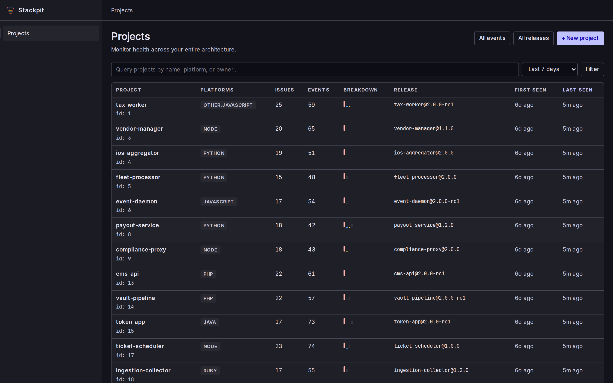
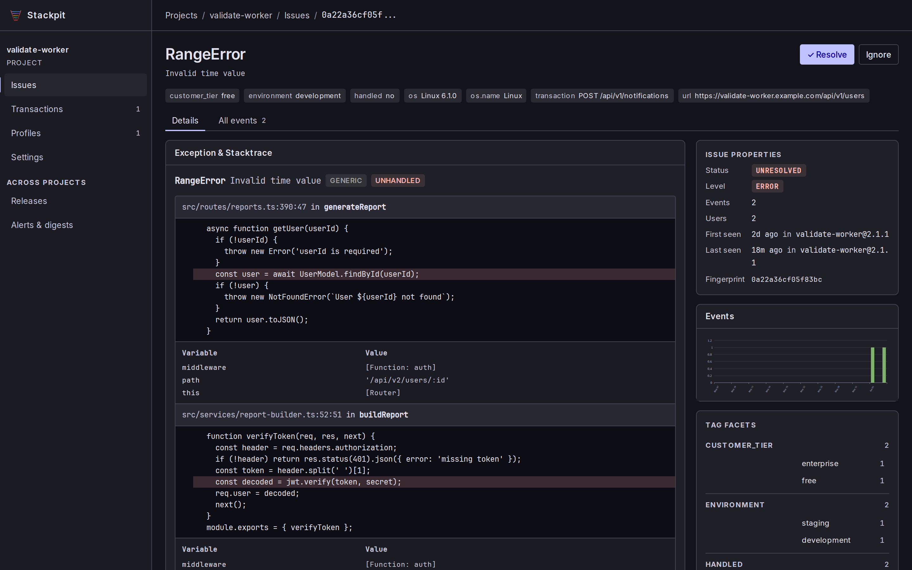
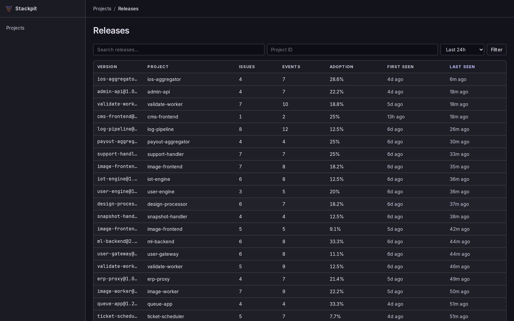
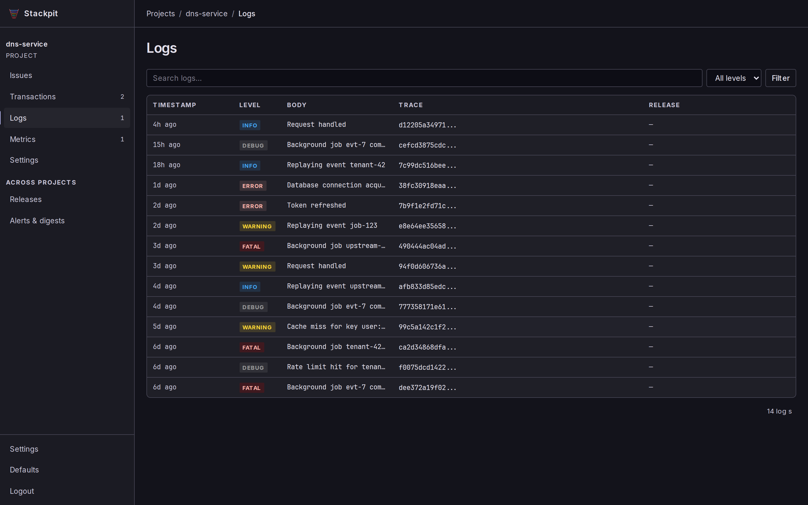
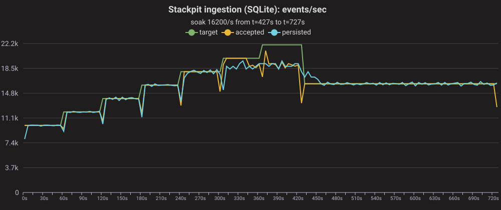

<div align="center">
  

  # Stackpit

  A drop-in, self-hosted replacement for Sentry's event ingestion and browsing. Single binary, single SQLite file, no external dependencies.

  [](https://github.com/franzos/stackpit/actions/workflows/ci.yml)
  [](https://github.com/franzos/stackpit/actions/workflows/release.yml)
  [](LICENSE)
  [](https://github.com/franzos/stackpit/pkgs/container/stackpit)

</div>

I got tired of paying for Sentry on smaller projects and self-hosting the official thing is... a lot. The thing is, most of what I need is ingestion, grouping, and a way to browse errors. So I built this — point your existing Sentry SDKs at it, browse errors in the web UI, or query via the JSON API.

<p align="center">
  
  
  
  
</p>

## Features

- **Drop-in Sentry protocol** — envelope and legacy store endpoints, all auth methods. Any Sentry SDK works, no code changes.
- **Single binary, no dependencies** — one process, one SQLite file. PostgreSQL optional.
- **Issue grouping** — fingerprint-based grouping with regressions and resolution tracking.
- **Server-rendered web UI** — browse issues, events, transactions, logs, traces, replays, monitors, and more.
- **Performance & tracing** — transaction percentiles, throughput, and failure rates, span waterfalls across traces, Web Vitals, and release-health crash-free rates.
- **JSON API** — query everything the UI shows.
- **Notifications & alerts** — email (Lettermint, Postmark, SendGrid, or SMTP) with digests and threshold rules. Slack and webhook delivery need a license; see [OSS vs Commercial](#oss-vs-commercial).
- **Source maps** — upload via `sentry-cli` so minified traces resolve to original source.
- **Monitors** — cron check-in tracking via Sentry's protocol.
- **Auth your way** — a shared admin token for solo use, or OAuth/OIDC SSO for teams.
- **[MCP endpoint](#mcp-hand-it-to-your-assistant)** — point Claude Code (or any MCP client) at `/mcp` and ask it why production is broken. OAuth-gated, scoped to your orgs, with read, write and admin tool tiers.
- **Organizations & roles.** Every user gets a personal org and can create more, invite others as owners or members, and manage membership and org slugs from the UI; data is scoped per org, mutations are owner-gated, and if your IdP emits org claims (Forseti-style), those orgs and roles map straight in.
- **Migrate in** — pull historical events, issues, and releases from an existing Sentry instance.
- **Integrations (commercial)** — Slack and webhook delivery, plus filing issues straight into GitHub, Forgejo, or GitLab from an issue page or the MCP tool. Email alerting stays free.
- **Observability (commercial)** — a token-gated Prometheus `/metrics` endpoint on the admin listener: HTTP request rates and latency, plus ingestion accept/reject/drop counters. Requires a license; see [OSS vs Commercial](#oss-vs-commercial) below.

## MCP: hand it to your assistant

Debugging with an assistant usually goes the same way: find the issue in the UI, copy the stacktrace, paste it into a chat window, repeat for the next event. Stackpit speaks [MCP](https://modelcontextprotocol.io) at `POST /mcp`, so the assistant can go read the data itself.

```sh
claude mcp add --transport http stackpit https://stackpit.example.com/mcp
```

The client discovers the authorization server, registers itself, and sends you through your normal SSO login. From there it gets 17 tools: list and search issues and events, pull a full event with its stacktrace, walk a trace's spans, check releases and crash-free rates, resolve an issue, file a tracker issue (the one tool that needs a license), and - behind a second consent - create or archive a project. "Why did checkout start failing after yesterday's release?" turns into a question it can actually answer, with real event IDs attached.

It's bearer-only: no cookies, no admin token (deliberately), only access tokens your IdP issued for this exact resource. Access follows your organization membership and is re-read from the IdP on every request, so a demotion upstream lands within the minute. Scopes come in tiers - `stackpit:events:read`, `stackpit:projects:read`, `stackpit:projects:write`, `stackpit:admin`. The first three are what the resource metadata advertises, so one login covers browsing and triage; `stackpit:admin` is deliberately left out, which is what makes creating and archiving projects cost a separate, explicit consent. Call a tool you don't hold the scope for and you get a `403` naming the one you're missing, which a client with incremental consent turns into a prompt for exactly that scope - though not every client implements the step-up, and Claude Code currently doesn't, so the two admin tools are out of reach there.

**The catch:** there's no per-project access control yet. Authorizing a client grants it every project in every org you belong to. Worth knowing before you click Allow on a shared instance.

**On the IdP side:** this needs an authorization server that binds the RFC 8707 `resource` parameter into the token's `aud`, and not all of them do. Ory Hydra ignores `resource` and derives the audience from its own parameter, which MCP clients don't send; tokens then arrive with `aud: []` and every call 401s. [Forseti](https://github.com/franzos/forseti) bridges that - list the resource once and it binds - and it's the same IdP that emits the `orgs` claim Stackpit maps organizations and roles from, so it's the combination this is built against.

Setup, scopes, and the audience gotcha in full are in the [operator guide](docs/operator-guide.md#mcp-endpoint).

## OSS vs Commercial

Stackpit's core is free and MIT-licensed: ingestion, grouping, the web UI and JSON API, organizations, auth/OIDC, email alerting, retention, everything you need to run it in production. Two features are gated behind a commercial license today.

| Capability | OSS (unlicensed) | Commercial |
|------------|-------------------|------------|
| Ingestion, grouping, source maps, monitors | Yes | Yes |
| Web UI + JSON API | Yes | Yes |
| Organizations, roles, IdP claim mapping | Yes | Yes |
| Auth: admin token, OAuth/OIDC SSO | Yes | Yes |
| MCP endpoint | Yes | Yes |
| Email alerts, digests, threshold rules | Yes | Yes |
| Retention & syncing from Sentry | Yes | Yes |
| Slack & webhook delivery (Integrations) | Unavailable | Yes |
| Issue trackers: GitHub, Forgejo, GitLab (Integrations) | Unavailable | Yes |
| Prometheus `/metrics` (Observability) | Unavailable (404) | Token-gated, on the admin listener |

Alerting itself is never gated: an unlicensed install still sends email for new issues, regressions, thresholds, and digests. What a license adds is delivery into Slack and webhooks, and filing issues into a tracker.

Licensing is offline (no phone-home, no host binding, no seat counting) and verified against a public key baked into the binary. Activate a license by pasting the blob at `/web/admin/license`; see [`docs/commercial/index.md`](docs/commercial/index.md) for how it works and the reasoning behind the MIT-core / commercial-gate split.

## Stackpit vs Sentry

Stackpit covers the everyday error-tracking workflow and a useful slice of performance monitoring, then deliberately stops short of Sentry's heavier features. It's a drop-in for the common case, not a full reimplementation. Here's roughly how they line up:

| Capability | Stackpit | Sentry |
|------------|----------|--------|
| Error ingestion (Sentry protocol, any SDK) | Yes | Yes |
| Issue grouping, regressions, resolution | Yes (own fingerprinting) | Yes (richer heuristics) |
| Source maps | Yes | Yes |
| Releases & release health (crash-free users/sessions) | Yes | Yes |
| Performance monitoring | Basic (percentiles, throughput, failure rate) | Full APM |
| Distributed tracing | Basic (span waterfalls) | Full |
| Web Vitals | Yes | Yes |
| Logs | Yes | Yes |
| Cron monitors | Yes | Yes |
| Session replay | Stores/browses what the SDK sends | Full player |
| Profiling | View-only | Full |
| Alerts (email, Slack, webhook, digests, thresholds) | Yes (Slack/webhook commercial) | Yes |
| Auth / SSO | Admin token + OAuth/OIDC | Yes |
| Organizations & roles | Self-serve orgs, per-org scoping, owner/member, invites, IdP claim mapping | Yes |
| Deployment | Single binary, one SQLite file | Many services (PostgreSQL, ClickHouse, Kafka, Redis) |
| Storage backend | SQLite or PostgreSQL | PostgreSQL + ClickHouse + Kafka |
| License | MIT, self-hosted | SaaS or heavy self-host |

Do take this with a grain of salt: the "basic" rows are genuinely basic, and the gaps are intentional. If deep APM, full-fidelity replay, or profiling are load-bearing for you, run the real thing.

## How fast is it?

Short version (one laptop, SQLite, ~2.9 KiB error envelopes):

| `ingest_batch_size` | Sustained (5 min, zero rejections) | Burst |
|---|---|---|
| 2000 (default) | ~10,800 events/s | 12,000-13,000 events/s |
| 10000 | ~15,000-18,000 events/s | ~20,700 events/s |

Details and trade-offs below.

The repo ships `stackpit-bench`, an open-loop load generator that ramps Sentry error envelopes against a running server until the write path falls behind, then soaks below that knee. The chart below is one run on a laptop: AMD Ryzen 5 7640U (6 cores / 12 threads), 64 GB RAM, NVMe SSD on LUKS-encrypted ext4, Linux 6.19, SQLite backend, with the load generator competing for the same cores.



- **Sustained 10,800 events/s for a 5-minute soak with zero rejections** (10,867 rows/s persisted on average), accept latency p50 1.7 ms / p99 6.9 ms, WAL peaking at 8.9 MiB.
- During the overload probes (14,000 and 16,000/s offered) the server accepted and persisted **12,000-13,000 events/s in bursts** and shed the rest with HTTP 503 backpressure; nothing is dropped silently. The knee varies between 12,000 and 14,000/s run to run on this machine (some runs hold 12,600/s for the full soak), hence the conservative sustained figure.
- Payloads are ~2.9 KiB error events across 100 distinct issues.

To reproduce (fresh database; `mode = "open"` auto-provisions the project on the first envelope). In `stackpit.toml`, set `ingest_bind = "127.0.0.1:3001"` and `rate_limit = 0` under `[filter]` first: `stackpit init` writes a default rate limit, and unlimited open-mode ingest requires a loopback bind (or an explicit `open_ingest_unlimited_acknowledged = true`):

```bash
cargo build --release -p stackpit-bench
stackpit serve &
./target/release/stackpit-bench \
  --url http://127.0.0.1:3001 --project 1 --key 0123456789abcdef0123456789abcdef \
  --db stackpit.db --ramp-start 10000 --ramp-step 2000 --ramp-interval 60 \
  --out bench-results
```

It ramps until the knee, soaks at 90% of it for 5 minutes, and writes a per-second CSV plus the SVG chart above. Single-machine numbers, so take them with a grain of salt.

There's more headroom in the batch size: the writer commits up to `ingest_batch_size` events per transaction (default 2000, set it in `[storage]`). Raising it to 10000 on the same laptop moved the knee from 14,000 to 20,000 events/s in back-to-back short-window runs, with ~20,700 rows/s persisted in the best 30-second windows: larger transactions amortize SQLite's commit and checkpoint cost. The trade-off is a bigger all-or-nothing unit: a write transaction that fails twice drops up to that many events, and each transaction holds the write lock longer. Sustained rates that high couldn't be verified here because the load generator saturates first; treat 10000 as burst-friendly tuning, not a validated sustained figure.

Running PostgreSQL instead? The bottleneck is Stackpit's write path, not the database. Unlike SQLite, PostgreSQL isn't stuck with one writer: set `ingest_writers` in `[storage]` and ingestion fans out across concurrent writer tasks, which comfortably handles 2-3x the single-writer rate.

## Install

| Method | Command |
|--------|---------|
| Cargo | `cargo install stackpit` |
| Homebrew | `brew tap franzos/tap && brew install stackpit` |
| Debian/Ubuntu | Download [`.deb`](https://github.com/franzos/stackpit/releases) — `sudo dpkg -i stackpit_*_amd64.deb` |
| Fedora/RHEL | Download [`.rpm`](https://github.com/franzos/stackpit/releases) — `sudo rpm -i stackpit-*.x86_64.rpm` |
| Guix | `guix install -L <panther> stackpit` ([Panther channel](https://github.com/franzos/panther)) |
| Docker | `docker pull ghcr.io/franzos/stackpit:latest` ([all tags](https://github.com/franzos/stackpit/pkgs/container/stackpit)) |

Pre-built binaries for Linux (x86_64) and macOS (Apple Silicon, Intel) on [GitHub Releases](https://github.com/franzos/stackpit/releases).

## Running

```bash
stackpit init            # writes stackpit.toml with a fresh admin_token
stackpit serve           # start both ingestion + admin UI
stackpit serve --ingest-only  # ingestion only, no admin UI/API
```

`stackpit init` generates a random 32-byte admin token and writes it into the config, so the admin UI is usable on first boot without any extra steps.

### Docker

Images are published to the GitHub Container Registry on every release — a default **SQLite** image and a **PostgreSQL** variant (same tags, `-postgres` suffix):

```bash
docker pull ghcr.io/franzos/stackpit:latest            # SQLite
docker pull ghcr.io/franzos/stackpit:latest-postgres   # PostgreSQL

# first run: generate stackpit.toml (with an admin token) into the volume
docker run --rm -v stackpit-data:/app ghcr.io/franzos/stackpit:latest ./stackpit init

# then serve
docker run -d --name stackpit \
  -p 3000:3000 -p 3001:3001 \
  -v stackpit-data:/app \
  ghcr.io/franzos/stackpit:latest
```

The SQLite file and `stackpit.toml` live in the working directory (`/app`) — mount a volume there to persist them. Note the admin listener binds to `127.0.0.1` by default, so set `bind = "0.0.0.0:3000"` in `stackpit.toml` for the mapped `3000` port to be reachable from outside the container.

### Ports

stackpit runs two listeners:

| Port | Default | Purpose |
|------|---------|---------|
| Admin | `127.0.0.1:3000` | Web UI + JSON API (localhost only) |
| Ingestion | `0.0.0.0:3001` | Receives SDK traffic (all interfaces) |

The admin port serves the browsing UI and API. The ingestion port is where your SDKs send events — it's the address you put in your DSN. I've found that keeping these separate makes deployment quite a bit more flexible.

`--ingest-only` skips the admin listener entirely, useful if you want dedicated ingestion nodes.

## Documentation

Full documentation is published at **<https://franzos.github.io/stackpit/>**, including the [user guide](docs/user-guide.md) for browsing and triaging errors in the web UI.

Everything past first boot — the full `stackpit.toml` reference, PostgreSQL, authentication and OIDC/SSO setup, connecting SDKs, notifications, source maps, monitors, syncing from Sentry, and the CLI — lives in the **[Operator Guide](docs/operator-guide.md)**:

- [Configuration](docs/operator-guide.md#configuration) — the full config reference, filter modes, [PostgreSQL](docs/operator-guide.md#postgresql), [ingestion tuning](docs/operator-guide.md#ingestion-tuning)
- [Authentication](docs/operator-guide.md#authentication) — admin token, OAuth/SSO (OIDC), [secret encryption](docs/operator-guide.md#secret-encryption)
- [MCP endpoint](docs/operator-guide.md#mcp-endpoint) — connecting an AI assistant, scopes, and what an authorized client can reach
- [Connecting SDKs](docs/operator-guide.md#connecting-sdks) — supported SDKs and DSN format
- [Notifications & Alerts](docs/operator-guide.md#notifications--alerts), [Source Maps](docs/operator-guide.md#source-maps), [Monitors](docs/operator-guide.md#monitors), [Web UI](docs/operator-guide.md#web-ui)
- [Syncing from Sentry](docs/operator-guide.md#syncing-from-sentry), [CLI tools](docs/operator-guide.md#cli-tools)

## Acknowledgements

This project wouldn't be possible without [Sentry](https://sentry.io) and is not meant to be a replacement, but rather a lightweight drop-in with limited features. If you need the full power of Sentry — profiling, full-fidelity session replay, advanced performance monitoring, and so on — use the real thing.

## Building

Requires Rust 1.94+ (sqlx 0.9's floor).

```bash
cargo build --release
```
